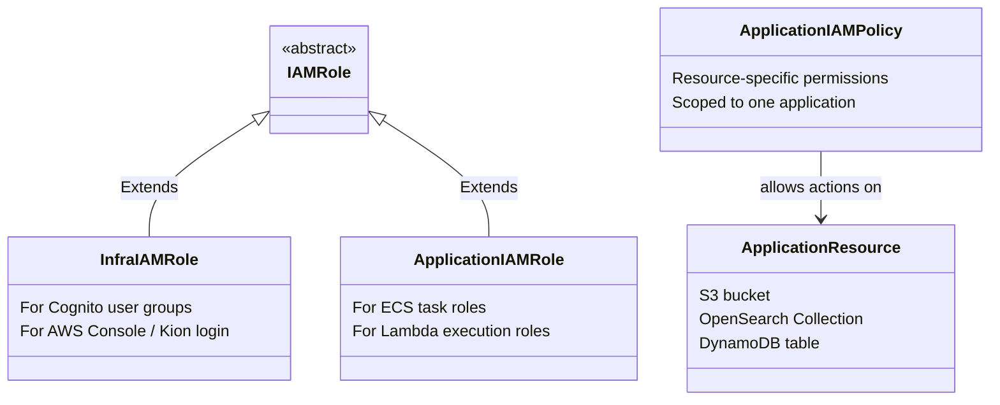
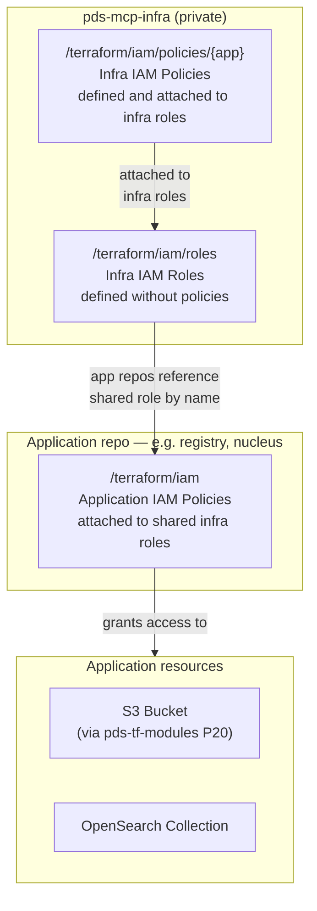

# Terraform Development Guidelines

> **Status:** Draft — supersedes the earlier "Terraform Development Guidelines" wiki page.
> **Sources:** HashiCorp official Terraform docs, AWS Prescriptive Guidance ("Best Practices for Using the Terraform AWS Provider," Aug 2025), internal PDS/PDC Terraform guidelines document, and PDS/PDC conventions. Full citations at the bottom.

Terraform is mandatory for all AWS infrastructure — it documents deployments as code, makes them reproducible, and enables continuous deployment via OIDC.

Two compliance tiers apply to all PDS/PDC repos:

- **Must-Have** — required on every PR. Enforced via code review and `scripts/validate_terraform.py` (see [Enforcement](#enforcement)).
- **Should-Have** — recommended; improvement backlog, not a merge blocker.

---

## Architecture overview

| Layer | Repo | Visibility | Owns |
|---|---|---|---|
| Shared infra | `pdc-cds-infra` | Public | Cognito, CloudFront, shared security groups |
| Shared IAM | `pds-mcp-infra` | Private | Org-wide IAM roles and infra policies |
| Application | Each app repo (e.g. `registry`, `nucleus`) | Public | App-specific resources and IAM policies |
| Deployment config | `<repo>-deploy` | Private (JPL Enterprise GitHub) | Per-venue `.tfvars`, secrets, GitHub Actions wiring |

**How repos talk to each other:** `pdc-cds-infra` and app repos publish outputs to SSM under `/pds/<component>/...`. Consuming repos read from SSM. No repo reads another repo's Terraform state directly.

**Multi-environment:** `venue` (dev/test/prod) and `tenant` are variables on one module — never copy-paste a repo per environment. Deployment parameters that must stay private (ARNs, account IDs, secrets) belong in the corresponding `<repo>-deploy` private repo, not in the public repo's `.tf` files.

**Modules (`pds-tf-modules`):** All shared, reusable AWS resource modules live in `NASA-PDS/pds-tf-modules`. This is the org's approved cybersecurity baseline for resources such as S3 buckets and EC2 instances — do not create these resource types directly with raw `aws_*` resources (see P20, P21).

---

## Must-Have checklist

Check IDs use three prefixes reflecting the origin of each requirement:

| Prefix | Meaning |
|--------|---------|
| **T** | Terraform/HashiCorp code conventions — how to structure and write `.tf` files |
| **A** | AWS/infrastructure best practices — how to design and secure infrastructure |
| **P** | PDS/PDC-specific requirements — org conventions and cybersecurity mandates |

### Terraform / HashiCorp code conventions (T-series)

| ID | Requirement | Why | Reference |
|----|-------------|-----|-----------|
| T1 | `terraform/` at repo root; shared/singleton infra only in `pdc-cds-infra` | Standard module entry point; prevents duplicate singletons | HashiCorp module structure |
| T2 | `main.tf`, `variables.tf`, `outputs.tf`, `versions.tf`, `README.md` all present | Standard structure every engineer expects | HashiCorp module structure |
| T3 | Provider config in `providers.tf` only; reusable modules never declare a provider block | Lets callers control provider version and config | HashiCorp provider docs |
| T4 | `modules/` kept flat (1–2 levels); no module that just wraps a single resource | Avoid abstraction for its own sake | HashiCorp module design |
| T8 | State files, real `.tfvars`, `.terraform/` in `.gitignore` | Keeps secrets and generated files out of git | HashiCorp best practices |
| T9 | `required_version` + `required_providers` with `~>` pin | Reproducible builds; blocks unexpected major bumps | HashiCorp version constraints |
| T10 | `.terraform.lock.hcl` committed for every root module | Pins provider checksums for all platforms | HashiCorp lock files |
| T11 | Every variable and output has a `type` and `description`; no silent defaults for env-specific values | Makes modules self-documenting and safe to call | HashiCorp variable docs |
| T14 | `snake_case`, singular, non-redundant resource names | Consistent, grep-friendly naming | HashiCorp style guide |
| T16 | Cross-repo module sources pinned to a tag or commit ref — never a default branch | Prevents silent breakage when upstream changes | HashiCorp module sources |

### AWS / infrastructure best practices (A-series)

| ID | Requirement | Why | Reference |
|----|-------------|-----|-----------|
| A5 | `backend.tf` (S3) on every deployable module — no local-state exceptions | Remote state enables team collaboration and CI | AWS Prescriptive Guidance |
| A7 | State locking enabled (`use_lockfile = true` or DynamoDB table wired) | Prevents concurrent apply corruption | Terraform + AWS docs |
| A12 | No hardcoded secrets, ARNs, or account IDs in committed `.tf` files — use variables or SSM | Avoids credential exposure and account coupling | AWS security best practices |
| A17 | AWS auth via assumed IAM role / OIDC only — no static long-lived keys | Static keys are a credential-leak risk | AWS IAM best practices |
| A18 | Terraform execution role follows least privilege | Limits blast radius if the role is compromised | AWS IAM best practices |

### PDS/PDC requirements (P-series)

| ID | Requirement | Why |
|----|-------------|-----|
| P6 | State bucket = `pds-<venue>-infra`, config supplied via `backend-<venue>.hcl` | One consistent naming scheme across all venues |
| P13 | Cross-component interfaces published via `/pds/<component>/...` SSM convention | Decouples repos without sharing state files |
| P15 | `default_tags` block with mandatory keys: `tenant`, `venue`, `component`, `managedby`, `cicd` — all lowercase, real values not placeholders. `managedby` must be the responsible **person's** email; a team email is acceptable only when `cicd` reflects actual GitHub automation | Required by PDS AWS Resource Tagging Strategy; drives cost allocation and compliance reporting |
| P19 | All `aws_iam_*` resources in a standalone `terraform/iam/` root module with its own state — never mixed into component resources | IAM is higher blast-radius; isolating it gates apply to privileged credentials only |
| P20 | All S3 buckets created via `pds-tf-modules//terraform/modules/s3/bucket` — never `resource "aws_s3_bucket"` directly | Enforces org cybersecurity baseline: AES-256 at rest, public-access blocks, SSL-only policy, `BucketOwnerEnforced` controls |
| P21 | All EC2 instances created via `pds-tf-modules//terraform/modules/ec2` — never `resource "aws_instance"` or `resource "aws_launch_template"` directly | Enforces org cybersecurity baseline: encrypted EBS root, MCP-approved AMI, MCP SSM/CloudWatch profile, no public IP |
| P22 | Cognito user pool users, groups, and group memberships are NOT managed in Terraform | Multiple modules contribute to one shared user pool — Terraform would cause modules to overwrite each other's contributions (see [Cognito user pool management](#cognito-user-pool-management)) |
| P23 | For every `backend-<venue>.hcl`, commit a matching `tfvars/<venue>.tfvars.example` to the public repo showing required variable names with placeholder values | Engineers cloning the repo know exactly which variables to supply; real values with secrets stay in the private `<repo>-deploy` repo or local gitignored `.tfvars` files |

---

## Should-Have checklist

### Standard recommendations

| ID | Recommendation |
|----|----------------|
| S1 | Real CI: blocking `fmt`/`validate`, `plan` posted on PR, `apply` gated behind approval via OIDC |
| S2 | TFLint (AWS ruleset) + Checkov in CI, non-blocking to start |
| S3 | Client-side pre-commit hooks: `fmt`, `tflint`, `checkov` |
| S4 | Module README input/output tables generated with `terraform-docs` |
| S5 | `examples/` directory for any module reused by more than one consumer |
| S10 | CloudTrail logging + alerting on Terraform state buckets |
| S11 | Sentinel/Checkov policy-as-code to auto-enforce tagging, naming, locking |
| S13 | Central tags module with explicit per-resource tagging for resource types `default_tags` doesn't cover reliably (IAM policy attachments, ASG-launched EC2 instances, launch templates, ENIs, security groups) |

### PDS/PDC-specific recommendations

| ID | Recommendation |
|----|----------------|
| S6 | Rebuild `template-repo-java` / `template-repo-python` `terraform/` dirs to reflect Must-Haves |
| S7 | Retire tutorial-boilerplate stub repos; consolidate `validate*` environment duplicates |
| S8 | Tag `pds-tf-modules` modules with semver; move toward `terraform-aws-<name>` naming |
| S9 | Promote `pdc-cds-infra`'s `cloudfront/pds-main` into `pds-tf-modules` as a reusable module |
| S12 | PR template includes a Terraform reviewer checklist mirroring the validator's "not statically checked" list |

---

## Code examples

### Root module layout (T2, A5, P6, P23)

```
terraform/
├── main.tf              # resources and calls to local modules
├── variables.tf         # all inputs — typed and described
├── outputs.tf           # all outputs — described
├── versions.tf          # required_version + required_providers
├── providers.tf         # provider "aws" block (root modules only)
├── backend.tf           # empty backend "s3" {} block
├── backend-dev.hcl      # bucket/key/region — committed; never contains credentials (P6)
├── backend-test.hcl
├── backend-prod.hcl
├── README.md
├── tfvars/
│   ├── dev.tfvars.example   # committed — variable names + placeholder values (P23)
│   ├── test.tfvars.example
│   └── prod.tfvars.example
└── modules/             # local nested modules, kept flat (T4)
    └── <name>/
```

**What lives where:**

| File | Committed to public repo? | Where real values go |
|---|---|---|
| `backend-<venue>.hcl` | Yes — bucket name and state key are not credentials | n/a; nothing sensitive |
| `tfvars/<venue>.tfvars.example` | Yes — shows variable names with placeholder values | n/a; no real values |
| `tfvars/<venue>.tfvars` | No — gitignored (T8) | `<repo>-deploy` private repo |

### Variables files (P23)

Commit `.example` files that document every required variable. Engineers copy the file, fill in real values, and keep the copy in the private `<repo>-deploy` repo (or gitignore it locally).

```hcl
# tfvars/dev.tfvars.example — copy to dev.tfvars in <repo>-deploy and fill in real values
tenant         = "en"
venue          = "dev"
component_name = "registry"
managed_by     = "<your-email@jpl.nasa.gov>"
```

The `.example` file must list every variable that has no default (or whose default is intentionally wrong for the env). It must never contain real ARNs, account IDs, or secrets — those belong in the gitignored `.tfvars`.

### Backend (A5, A7, P6)

```hcl
# backend.tf — committed, no environment-specific values
terraform {
  backend "s3" {}
}
```

```hcl
# backend-dev.hcl — per venue, committed to git
bucket       = "pds-dev-infra"
key          = "registry/opensearch_serverless.tfstate"
region       = "us-west-2"
use_lockfile = true   # native S3 locking (Terraform >= 1.10)
encrypt      = true
```

```sh
terraform init -backend-config=backend-dev.hcl
```

**Why `backend-<venue>.hcl` is committed, not gitignored:** the backend block can't use variables or expressions — bucket/key/region have to come from somewhere at `init` time, and partial configuration via `-backend-config=<file>` is Terraform's documented mechanism for supplying them (see [Backend Configuration](https://developer.hashicorp.com/terraform/language/backend)). HashiCorp's warning about `-backend-config` leaking values into `.terraform/` and plan files is specifically about *credentials*:

> We recommend using environment variables to supply credentials and other sensitive data. If you use `-backend-config` or hardcode these values directly in your configuration, Terraform will include these values in both the `.terraform` subdirectory and in plan files. This can leak sensitive credentials.

A bucket name, state key, and region are not credentials — nothing in `backend-<venue>.hcl` should ever be an `access_key`, `secret_key`, `profile`, or any other auth material (that's what A17's OIDC/assumed-role requirement is for). As long as that split holds, committing `backend-<venue>.hcl` is correct: it's what makes `terraform init -backend-config=backend-<venue>.hcl` reproducible for the whole team without needing the bucket name communicated out-of-band, and it's exactly the layout P6 requires.

### Version pinning (T9, T10)

```hcl
# versions.tf — root module: pin tightly
terraform {
  required_version = ">= 1.9.0"
  required_providers {
    aws = {
      source  = "hashicorp/aws"
      version = "~> 6.0"
    }
  }
}
```

```hcl
# versions.tf — reusable module: stay loose so callers control the pin
terraform {
  required_version = ">= 1.9.0"
  required_providers {
    aws = {
      source  = "hashicorp/aws"
      version = ">= 5.0, < 7.0"
    }
  }
}
```

### Variables & outputs (T11)

```hcl
variable "venue" {
  type        = string
  description = "Deployment venue: dev, test, or prod."

  validation {
    condition     = contains(["dev", "test", "prod"], var.venue)
    error_message = "venue must be one of: dev, test, prod."
  }
}

variable "component_name" {
  type        = string
  description = "Component name used to build SSM parameter paths."
  # no default — callers must supply; never silently inherit a wrong value
}

output "opensearch_endpoint" {
  description = "HTTPS endpoint of the OpenSearch domain."
  value       = aws_opensearch_domain.this.endpoint
}
```

### S3 buckets — required module usage (P20)

**All S3 buckets must use the org module.** It enforces the cybersecurity baseline so you don't have to wire it up yourself:

| Control | What the module enforces |
|---|---|
| Encryption at rest | AES-256 SSE on every object (default; upgradeable to KMS) |
| Public access | All four public-access blocks enabled by default |
| Bucket policy | SSL-only by default — denies all non-HTTPS requests |
| Ownership | `BucketOwnerEnforced` — ACLs disabled |
| Access logging | Configurable; if intentionally disabled, document the reason at the call site |
| Versioning | Configurable (default: disabled) |
| Multipart cleanup | Incomplete uploads aborted after 7 days by default |

```hcl
# Required — use the org module, pinned to a released tag (T16)
module "data_bucket" {
  source = "git@github.com:NASA-PDS/pds-tf-modules.git//terraform/modules/s3/bucket?ref=v1.2.0"

  bucket_name = "pds-${var.venue}-${var.component_name}-data"

  # enable_blocks / enable_policy default to true.
  # Only set false in venues where MCP enforces these controls at a higher level.

  required_tags = {
    tenant    = var.tenant
    venue     = var.venue
    component = var.component_name
    managedby = var.managed_by
    cicd      = "iac"
  }
}

# Wrong — never declare aws_s3_bucket directly; all cybersecurity controls above will be missing
# resource "aws_s3_bucket" "data" { ... }
```

### EC2 instances — required module usage (P21)

**All EC2 instances must use the org module.** It enforces the cybersecurity baseline:

| Control | What the module enforces |
|---|---|
| Encryption at rest | EBS root volume encrypted (`encrypted = true`) |
| Approved AMI | Selects the MCP-managed Amazon Linux 2 image automatically |
| Instance profile | MCP SSM/CloudWatch instance profile by default |
| Network exposure | `associate_public_ip_address = false` by default |
| Tagging | Explicitly tags instance, EBS volume, and network interface — covering the `default_tags` gap for EC2 child resources |

```hcl
# Required — use the org module, pinned to a released tag (T16)
module "registry_worker" {
  source = "git@github.com:NASA-PDS/pds-tf-modules.git//terraform/modules/ec2?ref=v1.2.0"

  pds_resource_prefix = "pds-${var.venue}"

  ec2_instance_configs = [
    {
      instance_name   = "registry-worker"
      instance_type   = "t3.medium"
      subnet_id       = data.aws_ssm_parameter.private_subnet_id.value
      security_groups = [module.security_groups.sg_id]
      key_pair_name   = var.key_pair_name
      az              = "us-west-2a"
    }
  ]

  required_tags = {
    tenant    = var.tenant
    venue     = var.venue
    component = var.component_name
    managedby = var.managed_by
    cicd      = "iac"
  }
}

# Wrong — never declare aws_instance or aws_launch_template directly; cybersecurity controls above will be missing
# resource "aws_instance" "worker" { ... }
```

### SSM interface (A12, P13)

Public repos must never contain hardcoded ARNs or account-specific values. Use variables for inputs and SSM for cross-component outputs.

```hcl
# outputs.tf — publish outputs to SSM so other components can consume them
locals {
  module_relative_path = replace(abspath(path.module), "/^.*\\/terraform\\//", "")
  ssm_prefix           = "/pds/${var.component_name}/${local.module_relative_path}"
}

resource "aws_ssm_parameter" "lambda_execution_role_arn" {
  name        = "${local.ssm_prefix}/lambda_execution_role_arn"
  type        = "String"
  value       = aws_iam_role.lambda_execution.arn
  description = "ARN of the Lambda execution role."
  tags        = local.tags
}
```

```hcl
# In a consuming repo — read from SSM, never from another repo's state
data "aws_ssm_parameter" "opensearch_endpoint" {
  name = "/pds/observability/opensearch/endpoint"
}
```

### Naming & tagging (T14, P15)

Mandatory tags per the PDS **AWS Resource Tagging Strategy** — all keys and values lowercase:

| Tag | Accepted values | Notes |
|---|---|---|
| `tenant` | `en`, `img`, `atm`, `sbn` | Owner discipline node |
| `venue` | `pds-cds-dev`, `pds-cds-test`, `pds-cds-prod` | Full environment identifier |
| `component` | Any lowercase GitHub repo name | e.g. `registry`, `nucleus`, `dum` |
| `cicd` | `con`, `cli`, `iac`, `manual`, `cd` | `con` = console, `cli` = AWS CLI, `iac` = Terraform, `cd` = full GitHub automation |
| `managedby` | Person's email; team email only when `cicd = cd` | e.g. `jane.doe@jpl.nasa.gov`; `pds-operator@jpl.nasa.gov` only when GitHub is deploying |
| `version` | Any string (optional) | Application version |

```hcl
provider "aws" {
  region = "us-west-2"
  default_tags {
    tags = {
      tenant    = var.tenant              # e.g. "en"
      venue     = "pds-cds-${var.venue}" # full form, e.g. "pds-cds-dev"
      component = var.component_name      # matches the GitHub repo name
      managedby = var.managed_by          # person's email; team email only when cicd = GitHub automation
      cicd      = "iac"
    }
  }
}
```

#### Tag value validation

The accepted value sets below are the **single source of truth**. They appear in two places that must stay in sync:

1. The Terraform `validation` blocks in your module's `variables.tf` (enforced at `terraform plan` time)
2. `TAG_VALUE_CONSTRAINTS` at the top of `scripts/validate_terraform.py` (enforced by the org validator)

When the tagging strategy changes, update both.

**`tenant`, `venue`, `cicd` — finite value sets, validate in variables.tf:**

```hcl
variable "tenant" {
  type        = string
  description = "Owner discipline node."
  validation {
    condition     = contains(["en", "img", "atm", "sbn"], var.tenant)
    error_message = "tenant must be one of: en, img, atm, sbn."
  }
}

variable "venue" {
  type        = string
  description = "Deployment venue — used to build the full tag value pds-cds-<venue>."
  validation {
    condition     = contains(["dev", "test", "prod"], var.venue)
    error_message = "venue must be one of: dev, test, prod."
  }
}

variable "cicd" {
  type        = string
  description = "Deployment method."
  validation {
    condition     = contains(["con", "cli", "iac", "manual", "cd"], var.cicd)
    error_message = "cicd must be one of: con (console), cli, iac (Terraform), manual, cd (full automation)."
  }
}
```

**`component`, `managedby` — free-form, not value-validated:**
- `component`: any lowercase GitHub repo name; no finite set to enforce
- `managedby`: person's email or GitHub URL; format varies, no accepted list

> **Tagging gap:** `default_tags` does not tag every resource type. Known gaps: IAM policy attachments, launch templates, ENIs, security groups, and ASG-launched EC2 instances. The EC2 org module (P21) handles this for EC2 by tagging instance, volume, and network interface explicitly. For other gap resources, add explicit `tags` blocks rather than relying on `default_tags` alone (see S13).
>
> **Tag enforcement:** AWS Resource Groups Tag Policies are active in MCP Dev (reporting-only) across ~28 resource types including `s3:bucket`, `ec2:instance`, `ec2:volume`, `iam:role`, `lambda:function`, `ecs:cluster`, `ecs:service`, and others. Non-compliant resources are surfaced (not blocked) under **AWS Resource Groups → Tag Policies**. Do not add new tag keys for cost allocation without confirming they are enabled in the JPL-wide Cost Explorer allocation set.

### Module sourcing (T16)

```hcl
# Wrong — tracks whatever is on the default branch today
module "s3_bucket" {
  source = "git@github.com:NASA-PDS/pds-tf-modules.git//terraform/modules/s3/bucket"
}

# Required — pinned to a released tag
module "s3_bucket" {
  source = "git@github.com:NASA-PDS/pds-tf-modules.git//terraform/modules/s3/bucket?ref=v1.2.0"
}
```

### IAM roles and policies (P19)

#### The IAM data model

Role–policy associations span multiple components and repos. The key distinction is whether a role is **infra-scoped** (org-wide, for humans) or **application-scoped** (component-specific, for services):



#### How Terraform assembles IAM across repos



**Rules:**
- `pds-mcp-infra` defines all **infra IAM roles** in `/terraform/iam/roles` — roles are created without policies attached.
- `pds-mcp-infra` defines and attaches **infra IAM policies** in `/terraform/iam/policies/{application name}/`.
- Application repos define **app-specific IAM policies** in their own `terraform/iam/` and attach them to the shared roles from `pds-mcp-infra`.
- No `aws_iam_*` resource is ever declared in a component's `terraform/` root — only in `terraform/iam/`.

#### Directory isolation (P19)

IAM changes are higher blast-radius than component resources. Isolating them in their own state means they can be planned and applied by a smaller, more privileged set of credentials.

```
terraform/
├── main.tf              # component resources — applied by the standard CI role
├── ...
└── iam/                 # standalone root module — own state, own apply, privileged credentials only
    ├── main.tf          # aws_iam_role, aws_iam_policy, aws_iam_role_policy_attachment
    ├── variables.tf
    ├── outputs.tf
    ├── versions.tf
    ├── backend.tf       # separate state key, e.g. <component>/iam.tfstate
    └── backend-<venue>.hcl
```

`terraform/iam/` is a full root module and must meet the complete Must-Have bar (T2, A5–A7, T9, T10, T11, P15, etc.) independently of `terraform/`. If a local module under `modules/` provisions IAM resources, it must only ever be called from `terraform/iam/`.

### CI auth (A17)

```yaml
permissions:
  id-token: write   # required for OIDC
  contents: read

steps:
  - uses: aws-actions/configure-aws-credentials@v4
    with:
      role-to-assume: arn:aws:iam::<account-id>:role/terraform-execution
      aws-region: us-west-2
```

---

## Cognito user pool management (P22)

**Do not manage Cognito users, user groups, or group memberships in Terraform.**

Multiple repos contribute resources to the same Cognito user pool. If any one of them managed users or groups via Terraform, it would overwrite the contributions of the others on each apply.

Instead, dedicated scripts extract user pool state to JSON and restore it to Cognito as needed. The production JSON backups live at:

```
s3://pds-prod-infra/dum_cognito/userpool_backups/
```

Refer to the "steps to upgrade the user pool" runbook for the full procedure. The current production pool is `nucleus-dum-cognito-user-pool`.

---

## Repo layout: shared infra vs. application repos

| Concern | pdc-cds-infra / pds-mcp-infra (shared) | Application repos |
|---|---|---|
| State bucket key | `pds-<venue>-infra`, prefixed by CDS component (`cognito/`, `cloudfront/`, `iam/`...) | `pds-<venue>-infra`, prefixed by app/component name |
| Owns | Singleton cross-cutting resources; org-wide IAM roles | App-specific resources and IAM policies |
| IAM | Infra roles (no policies), infra policies attached; isolated in `terraform/iam/` (P19) | App-specific policies attached to shared roles; isolated in `terraform/iam/` (P19) |
| Interface | Publishes to SSM under `/pds/<component>/...` | Reads from SSM — never reads another repo's state |
| Venue/tenant | Variables, not forked repos | Same |
| Deployment params | `pds-mcp-infra` (private) | `<repo>-deploy` private repo on JPL Enterprise GitHub |
| Change control | Highest blast radius — strictest review, blocking CI | Lower blast radius, same Must-Have bar |

---

## Enforcement

The validator alone is not enough. Use all four layers:

1. **`scripts/validate_terraform.py`** — static checks for the mechanically verifiable Must-Haves:
   - T-series: T2, T3, T8 (repo-level), T9, T10, T11, T14 (partial), T16
   - A-series: A5, A7, A12
   - P-series: P6, P15, P19, P20, P21, P23
   - Should-Haves: S1–S3, S5

   Must-Have failures exit non-zero; Should-Have warnings don't (unless `--strict`). Run it in CI, pre-commit, and locally.

2. **TFLint + Checkov** (S2) — AWS-specific resource-level checks the validator doesn't attempt: security group rules, additional encryption settings, IAM policy shape.

3. **The `terraform-conventions` Claude Code skill** (in `NASA-PDS/pds-agent-skills`) — primes any AI agent authoring or reviewing Terraform in these repos with this document, and requires running the validator before marking work complete.

4. **PR reviewer checklist** (S12) — the validator reports which Must-Haves it cannot check statically (T1, T4, T14 semantics, A17 runtime auth, A18 least-privilege IAM, P13 SSM consumption, P19 credential separation). These become explicit human sign-off items on every PR that touches `terraform/`.

---

## References

**HashiCorp**
- [Standard Module Structure](https://developer.hashicorp.com/terraform/language/modules/develop/structure)
- [Style Guide](https://developer.hashicorp.com/terraform/language/style)
- [Module creation — recommended pattern](https://developer.hashicorp.com/terraform/tutorials/modules/pattern-module-creation)

**AWS**
- [Prescriptive Guidance: Best Practices for Using the Terraform AWS Provider (Aug 2025)](https://docs.aws.amazon.com/prescriptive-guidance/latest/terraform-aws-provider-best-practices/introduction.html)
- [IAM: Confused deputy problem](https://docs.aws.amazon.com/IAM/latest/UserGuide/confused-deputy.html)
- [IAM: Getting started reducing permissions](https://docs.aws.amazon.com/IAM/latest/UserGuide/getting-started-reduce-permissions.html)

**PDS/PDC**
- **AWS Resource Tagging Strategy** (internal, PDSEN wiki) — source of record for P15 tag keys/values
- Companion "State of Terraform" report — empirical basis for PDS convention citations
